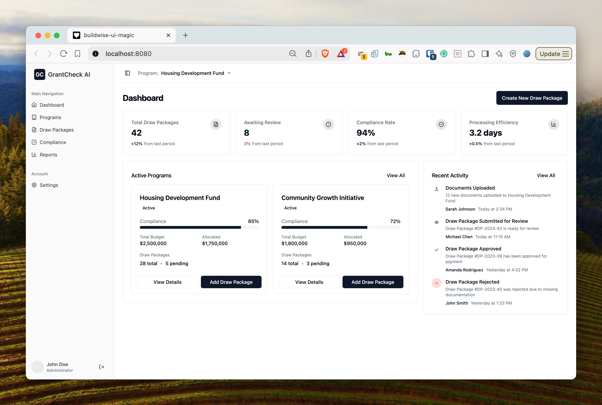
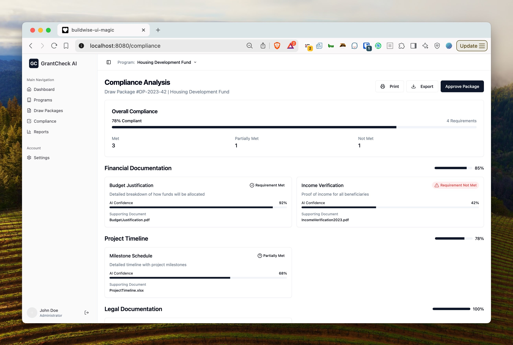

# BuildWise UI Magic

A modern React/TypeScript application that enhances the BuildWise experience with a sleek, intuitive user interface.

## Overview

BuildWise UI Magic is a modern web application built with React and TypeScript that transforms the standard BuildWise interface into a sleek, modern dashboard that makes project management and compliance tracking more efficient and user-friendly.

## Features

- **Modern Dashboard Interface**
  - Clean, intuitive layout
  - Quick access to key project information
  - Responsive design for all devices

- **Package Compliance Overview**
  - Visual representation of compliance status
  - Easy-to-read progress indicators
  - Quick access to compliance details

- **Enhanced User Experience**
  - Streamlined navigation
  - Improved data visualization
  - Better information hierarchy

## Screenshots

### Dashboard View


### Package Compliance Overview


## Tech Stack

- React 18 with TypeScript
- Vite for build tooling
- Radix UI for accessible components
- Tailwind CSS for styling
- Modern development tooling (ESLint, TypeScript)

## Getting Started

### Prerequisites

- Node.js 18 or higher
- npm or yarn package manager

### Installation

1. Clone the repository
2. Install dependencies:
   ```bash
   npm install
   # or
   yarn install
   ```
3. Create a `.env` file based on `.env.example`
4. Start the development server:
   ```bash
   npm run dev
   # or
   yarn dev
   ```

### Building for Production

```bash
npm run build
# or
yarn build
```

## Development

- `npm run dev` - Start development server
- `npm run build` - Build for production
- `npm run build:dev` - Build for development
- `npm run lint` - Run ESLint
- `npm run preview` - Preview production build

## Support

For support, feature requests, or bug reports, please visit our [GitHub Issues](https://github.com/yourusername/buildwise-ui-magic/issues) page.

## License

This project is licensed under the MIT License.

## Changelog

See [CHANGELOG.md](CHANGELOG.md) for a list of changes and version history.

## Project info

**URL**: https://buildwise.dev/projects/buildwise-ui-magic

## How can I edit this code?

There are several ways of editing your application.

**Use BuildWise**

Simply visit the [BuildWise Project](https://buildwise.dev/projects/buildwise-ui-magic) and start prompting.

Changes made via BuildWise will be committed automatically to this repo.

**Use your preferred IDE**

If you want to work locally using your own IDE, you can clone this repo and push changes. Pushed changes will also be reflected in BuildWise.

The only requirement is having Node.js & npm installed - [install with nvm](https://github.com/nvm-sh/nvm#installing-and-updating)

Follow these steps:

```sh
# Step 1: Clone the repository using the project's Git URL.
git clone <YOUR_GIT_URL>

# Step 2: Navigate to the project directory.
cd buildwise-ui-magic

# Step 3: Install the necessary dependencies.
npm i

# Step 4: Start the development server with auto-reloading and an instant preview.
npm run dev
```

**Edit a file directly in GitHub**

- Navigate to the desired file(s).
- Click the "Edit" button (pencil icon) at the top right of the file view.
- Make your changes and commit the changes.

**Use GitHub Codespaces**

- Navigate to the main page of your repository.
- Click on the "Code" button (green button) near the top right.
- Select the "Codespaces" tab.
- Click on "New codespace" to launch a new Codespace environment.
- Edit files directly within the Codespace and commit and push your changes once you're done.

## What technologies are used for this project?

This project is built with .

- Vite
- TypeScript
- React
- shadcn-ui
- Tailwind CSS

## How can I deploy this project?

Simply open [BuildWise](https://buildwise.dev/projects/buildwise-ui-magic) and click on Share -> Publish.

## I want to use a custom domain - is that possible?

We don't support custom domains (yet). If you want to deploy your project under your own domain then we recommend using Netlify. Visit our docs for more details: [Custom domains](https://docs.lovable.dev/tips-tricks/custom-domain/)
